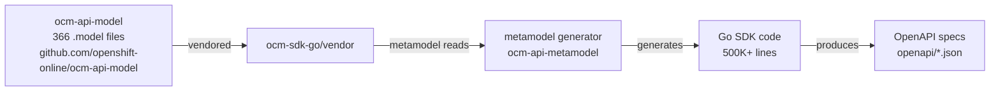

# HCP-Only OCM SDK Implementation Guide

## 🎯 Key Discovery: How the SDK is Actually Built

After analyzing your local `ocm-sdk-go` repository, here's the actual architecture:

### Current SDK Generation Flow



## 📁 Repository Structure Found

```
/Users/jzimmerm/projects/redhat/ocm-sdk-go/
├── openapi/                    # Generated OpenAPI specs
│   └── clusters_mgmt/v1/
│       └── openapi.json        # 19,691 lines!
├── vendor/
│   └── github.com/openshift-online/ocm-api-model/
│       ├── model/              # Source model files
│       │   └── clusters_mgmt/v1/
│       │       ├── *.model     # 366 model files
│       └── clientapi/          # Generated Go types
├── metamodel_generator/        # Generator tool
└── hack/
    ├── generate-client.sh      # Runs metamodel
    └── generate-openapi.sh     # Creates OpenAPI
```

## 🔧 Step-by-Step Implementation Plan

### Step 1: Create HCP-Only Model Set

```bash
cd /Users/jzimmerm/projects/redhat

# Clone the SDK
cp -r ocm-sdk-go ocm-sdk-go-hcp
cd ocm-sdk-go-hcp

# Create filtered model directory
mkdir -p vendor-hcp/github.com/openshift-online/ocm-api-model/model
```

### Step 2: Filter Model Files

Create a script to copy only HCP-relevant models:

```bash
#!/bin/bash
# filter-models.sh

SOURCE="vendor/github.com/openshift-online/ocm-api-model/model"
TARGET="vendor-hcp/github.com/openshift-online/ocm-api-model/model"

# Copy directory structure
find $SOURCE -type d -exec mkdir -p $TARGET/{} \;

# HCP-specific patterns to KEEP
KEEP_PATTERNS=(
    "node_pool"
    "hypershift"
    "external_auth"
    "oidc"
    "addon"
    "cluster_type"
    "aws_type"
    "version"
    "identity_provider"
    "ingress"
    "dns"
    "break_glass"
    "kubelet_config"
    "tuning_config"
    "sts_"
    "role"
    "operator"
)

# Classic patterns to EXCLUDE
EXCLUDE_PATTERNS=(
    "machine_pool"
    "machine_type"
    "flavour"
    "classic"
    "aws_infrastructure_access"
    "compute_nodes"
)

# Copy filtered files
for file in $(find $SOURCE -name "*.model"); do
    base=$(basename $file)
    
    # Check if file should be excluded
    exclude=false
    for pattern in "${EXCLUDE_PATTERNS[@]}"; do
        if [[ $base == *"$pattern"* ]]; then
            exclude=true
            break
        fi
    done
    
    # If not excluded, check if it's needed
    if [ "$exclude" = false ]; then
        # Always copy common types
        if [[ $base == *"error"* ]] || [[ $base == *"metadata"* ]] || [[ $base == *"list"* ]]; then
            cp $file $TARGET/${file#$SOURCE/}
        else
            # Check if it matches keep patterns
            for pattern in "${KEEP_PATTERNS[@]}"; do
                if [[ $base == *"$pattern"* ]]; then
                    cp $file $TARGET/${file#$SOURCE/}
                    break
                fi
            done
        fi
    fi
done
```

### Step 3: Modify Generation Scripts

Update `hack/generate-client.sh`:

```bash
#!/bin/bash

source "$(dirname "${BASH_SOURCE}")/init.sh"

METAMODEL="${1:-metamodel_generator/metamodel}"
TARGET_DIR="${2:-.}"

# Clean existing output
$(dirname "${BASH_SOURCE}")/clean-client.sh "${TARGET_DIR}"

# Use filtered models
${METAMODEL} generate go \
  --model=vendor-hcp/github.com/openshift-online/ocm-api-model/model \
  --base=github.com/openshift-online/ocm-sdk-go-hcp \
  --apiBase=github.com/openshift-online/ocm-api-model/clientapi \
  --generators=builders-alias,clients,errors,helpers,json-alias,request-json,metrics,openapi,types-alias \
  --output="${TARGET_DIR}" \
  --hcp-only  # Add flag if metamodel supports it
```

### Step 4: Create HCP-Only OpenAPI Filter

```go
// cmd/filter-openapi/main.go
package main

import (
    "encoding/json"
    "fmt"
    "io/ioutil"
    "strings"
)

func main() {
    // Read clusters_mgmt OpenAPI
    data, _ := ioutil.ReadFile("openapi/clusters_mgmt/v1/openapi.json")
    
    var spec map[string]interface{}
    json.Unmarshal(data, &spec)
    
    // Filter paths
    paths := spec["paths"].(map[string]interface{})
    filteredPaths := make(map[string]interface{})
    
    for path, value := range paths {
        // Keep HCP paths
        if strings.Contains(path, "node_pool") ||
           strings.Contains(path, "hypershift") ||
           strings.Contains(path, "external_auth") ||
           strings.Contains(path, "oidc") ||
           strings.Contains(path, "break_glass") {
            filteredPaths[path] = value
        }
        // Skip Classic paths
        if strings.Contains(path, "machine_pool") ||
           strings.Contains(path, "flavour") {
            continue
        }
    }
    
    spec["paths"] = filteredPaths
    
    // Filter schemas similarly
    schemas := spec["components"].(map[string]interface{})["schemas"].(map[string]interface{})
    filteredSchemas := make(map[string]interface{})
    
    for name, schema := range schemas {
        if !strings.Contains(name, "MachinePool") &&
           !strings.Contains(name, "Flavour") {
            filteredSchemas[name] = schema
        }
    }
    
    spec["components"].(map[string]interface{})["schemas"] = filteredSchemas
    
    // Write filtered spec
    output, _ := json.MarshalIndent(spec, "", "  ")
    ioutil.WriteFile("openapi/clusters_mgmt/v1/openapi-hcp.json", output, 0644)
}
```

### Step 5: Build and Test

```bash
# Install metamodel generator
make metamodel-install

# Run filtered generation
./hack/generate-client.sh

# Test compilation
go build ./...

# Check size reduction
echo "Original SDK:"
find . -name "*.go" | xargs wc -l | tail -1

echo "HCP-only SDK:"
find . -name "*.go" -not -path "./vendor/*" | xargs wc -l | tail -1
```

## 📊 Expected Results

### File Count Reduction
```
Original: 366 model files → HCP: ~100 model files (73% reduction)
Original: 261 schemas → HCP: ~80 schemas (70% reduction)
```

### Code Size Reduction
```
clusters_mgmt/v1/:
  Original: ~300 Go files → HCP: ~100 files
  Original: ~200K lines → HCP: ~50K lines
```

### API Surface
```
Removed:
- MachinePool (all types)
- Flavour types
- Classic infrastructure types
- AWS infrastructure access roles
- Non-STS auth types

Kept:
- NodePool (all types)
- Hypershift config
- External auth
- OIDC config
- Break-glass credentials
- Add-ons
- Ingress
- DNS domains
```

## 🚀 Quick Validation

```bash
# Test with your HCP CLI
cd /Users/jzimmerm/projects/redhat/rosa/rosa-hcp-starter

# Update go.mod to use local HCP SDK
go mod edit -replace github.com/openshift-online/ocm-sdk-go=/Users/jzimmerm/projects/redhat/ocm-sdk-go-hcp

# Build and test
go build ./cmd/rosa
./rosa list clusters
```

## ⚠️ Important Considerations

### 1. Model Dependencies
Some HCP models depend on common types. Keep these:
- Error types
- Metadata types  
- Value types (String, Integer, etc.)
- Common AWS types
- Version types

### 2. Service Dependencies
Keep these service models even if not purely HCP:
- accounts_mgmt (authentication)
- authorizations (permissions)
- addons_mgmt (add-ons)

### 3. Breaking Changes
The filtered SDK won't be compatible with Classic clusters, which is the goal!

## 📝 Alternative Approach: Runtime Filtering

If modifying the generator is complex, consider runtime filtering:

```go
// pkg/filter/hcp.go
package filter

import "github.com/openshift-online/ocm-sdk-go/clustersmgmt/v1"

// WrapClient filters Classic operations
type HCPOnlyClient struct {
    *cmv1.Client
}

func (c *HCPOnlyClient) MachinePools() error {
    return fmt.Errorf("machine pools not supported in HCP-only mode")
}

// Only expose NodePools
func (c *HCPOnlyClient) NodePools() *cmv1.NodePoolsClient {
    return c.Client.NodePools()
}
```

## 🎯 Next Steps

1. **Start with Model Filtering** - Create the filter script and run it
2. **Test Generation** - Run metamodel with filtered models
3. **Validate Output** - Ensure HCP operations work
4. **Optimize Further** - Remove unused helpers and utilities
5. **Package as Module** - Publish as `ocm-sdk-go-hcp`

---

**Key Insight**: The real work is filtering the `.model` files in `vendor/github.com/openshift-online/ocm-api-model/model/`. The SDK generation is automatic from there!
